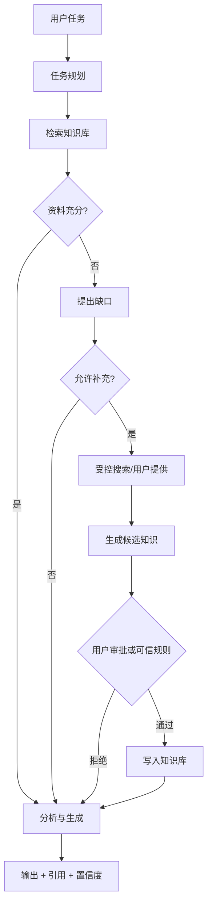

# Knowledge Agent 路线图

## 目标

构建一个 Agent，它可以：

1. 理解用户要完成的任务
2. 自动从知识库检索所需资料
3. 判断资料是否充分、是否冲突
4. 生成分析、报告、方案或行动清单
5. 发现缺口时提出补充建议
6. 在获得授权后，把新知识写回知识库

## 关键原则

### 默认只读

Agent 默认只读知识库。生成结果不会自动变成“事实”。

### 写入需要分级权限

| 模式 | 行为 |
|---|---|
| Read | 仅检索和回答 |
| Propose | 生成候选知识卡，等待确认 |
| Auto-save draft | 自动保存为“待验证”草稿 |
| Trusted write | 只对特定项目和规则开放自动写入 |

### 每条新知识必须有 provenance

```json
{
  "origin": "agent",
  "taskId": "...",
  "sourceIds": ["K1", "K2"],
  "model": "...",
  "createdAt": "...",
  "status": "draft",
  "confidence": 0.78
}
```

### 外部材料不能自动成为可信事实

网页、邮件和 Agent 结果都按不可信输入处理。系统必须区分：

- 原始资料
- Agent 推断
- 用户确认
- 已验证事实

## Agent 工作循环



## 第一版 Agent（已实现）

先做“分析 Agent”，不做完全自治。

输入：

- 目标
- 输出格式
- 项目范围
- 时间范围
- 是否允许提出补充材料

工具：

- `search_knowledge(query, filters)`
- `read_knowledge(ids)`
- `compare_sources(ids)`
- `propose_knowledge(card)`
- `save_draft(card, approvalToken)`

输出：

- 最终结果
- 引用来源
- 发现的冲突
- 未解决的信息缺口
- 候选新知识

当前实现包含独立 Agent 页面、执行前计划与来源确认、本地 Browser Prompt API /
Ollama 执行、严格 JSON 候选卡、逐条批准/拒绝、可撤销写入和不可变审计日志。
既有知识在架构迁移时标记为 `raw`；Agent 批准默认创建 `draft`，只有用户明确
选择时创建 `verified`。撤销不删除记录，而是把创建的知识标记为 `deprecated`，
保留 provenance、候选卡和审计链。

运行、候选卡和审计 ledger 会随 OneDrive v2 操作日志及版本 2 JSON 备份移植；
SQLite 备份仍是完整数据库时间点副本。同步不包含 provider 凭据。候选卡固定来源
版本、内容哈希和生命周期（在执行计划创建时固定），候选创建或审批时若来源被
编辑、删除或废弃，必须重新运行 Agent。`deprecated` 在编辑、同步和恢复中保持
单调，不提供普通重新激活路径。
规划响应包含服务端固定的完整来源快照，provider 不再使用规划前的内存副本。
并发审批通过 proposal 派生 ID 收敛，撤销覆盖全部关联审批写入；取消流程使用
执行代次隔离，直到服务端取消完成前保持规划控件锁定。
Agent 审批条目禁止普通实质编辑；来源固定依赖语义修订/哈希而非浏览计数操作。
审批 ledger 若先于知识操作到达会延后处理，目标知识、provenance、内容与生命周期
全部验证通过后才可用于撤销。

## 第二版 Agent（未来）

- 多步任务计划
- 任务状态与可恢复执行
- 用户批准的网页补充搜索（当前开关禁用；尚未实现）
- 定时项目简报
- 冲突和过期知识提醒
- 同一任务产生知识之间的关系图

## 第三版 Agent

- 团队知识空间
- ACL 和最小权限
- Entra ID / SharePoint 权限继承
- 敏感标签
- 审计、撤销和版本回滚
- Agent-to-Agent 知识协议

## 数据模型扩展

建议新增：

- `status`: raw / draft / verified / deprecated
- `confidence`
- `sourceIds`
- `relations`
- `validFrom` / `validTo`
- `agentRunId`
- `approvedBy`
- `approvedAt`

## 安全控制

1. 每个工具有独立权限
2. 写入操作需要明确 scope
3. 外部搜索默认关闭
4. 新知识先进入 draft
5. 保留完整执行日志
6. 支持撤销 Agent 批量写入
7. 限制单次读取和写入数量
8. 提示注入检测与来源隔离

## 成功指标

- Agent 输出引用覆盖率
- 用户接受候选知识的比例
- 新知识再次被检索的比例
- 错误写入和撤销率
- 任务完成时间下降
- 信息缺口发现率

## 已完成的第一阶段

在现有 Ask 页面上增加“任务模式”：

1. 用户指定目标和输出格式
2. 系统生成检索计划
3. 展示将读取的知识范围
4. Agent 分析并输出
5. 单独展示“建议补充到知识库”的卡片
6. 用户逐条批准写入

以上流程已实现，并保持默认只读。下一阶段重点是受控外部补充、可恢复多步执行
和更细粒度项目权限；在此之前不会进行外部搜索。
