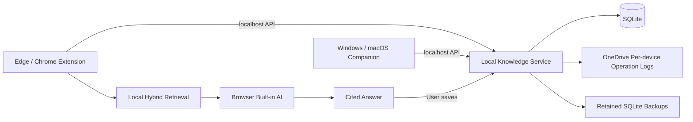

# AI Knowledge Inbox 项目记录

## 1. 项目起点

AI 工具已经从单一聊天机器人扩展到 Copilot、ChatGPT、Claude、IDE Agent、浏览器助手和桌面应用。它们每天生成方案、代码、分析、决策和灵感，但产出分散在不同会话和平台中。

最初的问题是：

> 能否用一个动作，把所有 AI 和 Agent 的有价值产出保存进自己的知识库，并在未来再次找到、组合和使用？

## 2. 核心痛点

1. **信息散落**：内容被锁在不同产品、会话和设备中。
2. **重复劳动**：相似问题被反复询问，旧答案没有形成资产。
3. **缺少出处**：复制到笔记后，模型、页面和原始链接容易丢失。
4. **知识只进不出**：传统收藏夹能保存，却难以综合回答新问题。
5. **隐私顾虑**：企业和个人知识不适合默认上传到新的托管平台。
6. **跨端割裂**：网页扩展无法直接覆盖 Copilot 等桌面应用。

## 3. 产品原则

- **一键负责采集，系统负责整理**
- **原文始终可追溯**
- **本地优先，用户拥有数据**
- **没有 AI 时仍然可用**
- **AI 回答必须显示引用**
- **自动写入必须有权限和来源记录**

## 4. MVP 演进过程

### 阶段 A：极简网页 MVP

第一版只验证：

```text
复制 AI 输出 → 粘贴 → 保存 → 搜索
```

采用单文件 HTML 和浏览器本地存储，包含保存、列表、关键词搜索、删除和 JSON 备份。

验证结论：用户愿意保存，但手动打开网页和粘贴仍有摩擦。

### 阶段 B：浏览器扩展

引入 Manifest V3 扩展：

- 网页选区右键保存
- 快捷键打开采集弹窗
- 自动记录页面标题和来源
- 项目与标签
- 编辑、筛选和导出

随后加入：

- 本地自动标签建议
- 重复正文拦截
- HTML 选区转 Markdown
- 安全 Markdown 预览
- 使用统计与相关知识推荐
- 本地轻量语义向量搜索

### 阶段 C：桌面伴侣

为 Copilot 桌面端设计：

```text
复制内容 → 全局快捷键 → 确认 → 保存
```

Windows 使用 `Ctrl + ;`，桌面伴侣通过本地 HTTP 服务写入 SQLite。浏览器扩展与桌面应用由此共享同一个知识库。

### 阶段 D：OneDrive 同步

没有把 SQLite 文件直接放入 OneDrive，因为数据库锁、WAL 和多端同时写入可能导致损坏。

初始方案：

- SQLite 仍是本地主库
- OneDrive 中保存可合并 JSON 快照
- 条目采用最后修改时间优先
- 删除通过 tombstone 传播，避免旧快照让知识“复活”
- 保存后快速同步，每分钟拉取其他设备更新

同步 v2 将共享快照改为：

- 每台设备只原子写入自己的 `operations/<device-id>.json`
- 每个新增、修改和删除操作携带设备、逻辑计数与版本向量
- 因果上占优的操作自动应用；并发操作按稳定规则选择当前结果，同时持久化冲突供用户选择本地、传入或合并版本
- `knowledge-sync.json` 继续生成，但只作为可读兼容快照，不再是权威同步源
- 限时混合版本迁移窗口内，v2 只读兼容快照并将 v1 变更转为操作；窗口结束前 v1 不接收 v2 新变更
- SQLite 使用显式版本迁移；v1 数据库升级后保留条目和 tombstone
- 每日创建本地 SQLite 一致性备份，保留最近 7 份；恢复前自动创建安全备份

### 阶段 E：Ask 知识库

Ask 使用本地混合检索：

```text
问题
→ 关键词权重 + 本地语义向量
→ 选取 5–8 条相关知识
→ 浏览器内置 AI 综合
→ Markdown 回答 + [K1] 引用
→ 可保存回知识库
```

知识正文被明确包裹为不可信来源数据，系统提示要求模型不得执行来源中的指令，降低提示注入风险。

### 阶段 F：跨平台与发布

- 浏览器增加中文 / English
- Windows 桌面采集器统一为科技风
- 增加 macOS 原生菜单栏伴侣和 `Command + ;`
- 建立可复现 Windows ZIP、macOS DMG 和扩展 ZIP 构建
- 准备 GitHub Releases、Pages、Edge Add-ons 和 Chrome Web Store 素材

## 5. 当前产品能力

| 模块 | 能力 |
|---|---|
| 浏览器采集 | 选区保存、Markdown、标题、URL |
| 桌面采集 | Windows `Ctrl + ;`、macOS `Command + ;` |
| 知识管理 | 编辑、项目、标签、摘要、去重 |
| 搜索 | 关键词、筛选、本地语义向量 |
| AI | 智能标题摘要、引用式 Ask |
| 数据 | SQLite、JSON 备份、Markdown 导出 |
| 同步 | 用户自己的 OneDrive |
| UI | 中文 / English、两套知识库皮肤 |

## 6. 技术架构



### 数据边界

- 服务只监听 `127.0.0.1`
- 普通网页 Origin 被拒绝
- 扩展无远程代码
- Markdown 使用 DOM API 渲染，不使用 `innerHTML`
- 发布包附 SHA-256

## 7. 用户价值

### 对个人

- AI 产出不再一次性消费
- 重新找到旧结论的成本降低
- 可以跨工具、跨时间整合观点
- 用户保留数据控制权

### 对团队和企业

- 形成可追溯的 AI 工作资产
- 保留来源与决策上下文
- 降低重复调研和重复提问
- 可演进到企业权限、标签和审计体系

## 8. 差异化

AI Knowledge Inbox 不是又一个聊天机器人，也不是单纯的网页收藏夹。

它的差异是：

1. 跨网页与桌面 AI 采集
2. 本地优先，不要求新云账号
3. OneDrive 用户自有同步
4. AI 回答带知识引用
5. AI 生成的新知识可以重新沉淀
6. 面向未来 Agent 的可读写知识层

## 9. 当前限制

- macOS Beta 尚未签名和公证
- 浏览器 Prompt API 并非所有设备可用
- 本地语义向量是轻量实现，不等同于大型 Embedding 模型
- 并发同步冲突需要用户在桌面服务 API 中明确解决，浏览器 UI 尚未提供冲突管理界面
- 浏览器扩展尚未上架商店
- 自动 Agent 写库尚未开放，需先完成权限和审批机制

## 10. 下一阶段

1. 真实用户 Beta 和留存验证
2. Edge / Chrome 商店发布
3. Windows 代码签名、macOS Developer ID 与公证
4. Ollama / Azure OpenAI 可选模型适配器
5. Obsidian Vault 直接导出
6. 权限化 Knowledge Agent
7. 企业共享空间、ACL、敏感标签和审计

## 11. 成功指标

- 新用户 5 分钟内完成安装并保存第一条知识
- 一周内保存 20 条以上
- 一周内至少 3 次主动搜索或 Ask
- 保存到再次使用的知识复用率
- 同步失败、重复与丢失率
- Ask 回答的引用点击率与保存率
