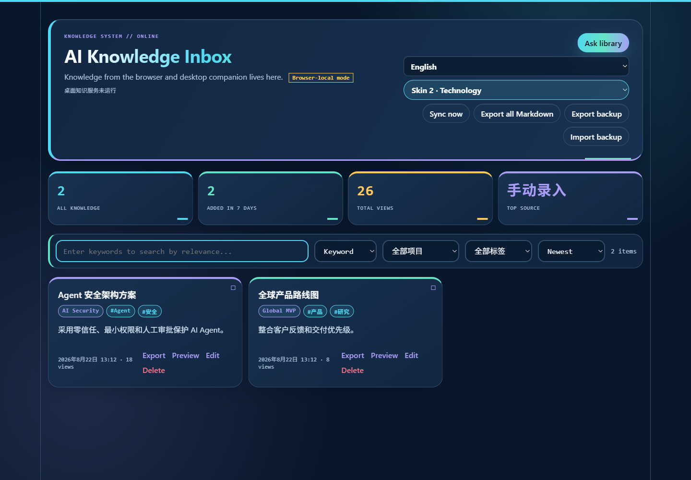
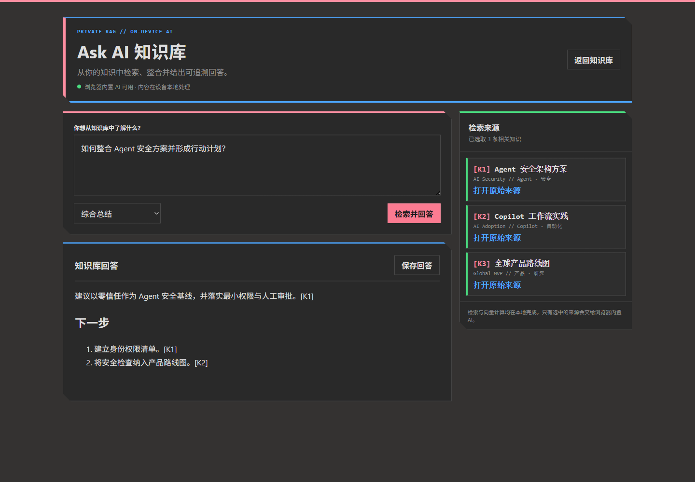

# AI Knowledge Inbox

> 把散落在 Copilot、ChatGPT、Claude 和网页里的 AI 产出，变成一个本地优先、可搜索、可追溯、可继续生长的个人知识库。

Windows / macOS companion | Edge / Chrome extension | SQLite | OneDrive | Cited Ask

---

AI Knowledge Inbox 解决一个简单问题：**AI 每天生成很多有价值的内容，但它们通常留在不同应用和会话里，之后很难再次找到和复用。**

它提供：

- 桌面端复制后按快捷键保存：Windows `Ctrl + ;`，macOS `Command + ;`
- 浏览器选区右键保存，保留常见 Markdown 格式
- 项目、标签、摘要、关键词与本地语义搜索
- Ask 知识库：本地检索，浏览器内置 AI 综合，回答附 `[K1]` 引用
- SQLite 本地存储和用户自己的 OneDrive 同步
- 中文 / English 界面
- Markdown 和 JSON 导出

---

---

## 安装

从 [Releases](https://github.com/lindaf0617-hub/ai-knowledge-inbox/releases/latest) 下载：

- Windows：`AI-Knowledge-Inbox-<version>-Windows.zip`
- macOS：`AI-Knowledge-Inbox-<version>-macOS-unsigned.dmg`
- 仅浏览器扩展：`AI-Knowledge-Inbox-Extension-<version>.zip`

Windows 解压后运行 `安装 Beta.cmd`。macOS 首个 Beta 尚未签名，需按 Release 说明允许打开。

浏览器扩展暂以 Developer mode 加载；商店版本准备中。

---

## 隐私

- 主库保存在本机 SQLite
- 本地服务只监听 `127.0.0.1`
- OneDrive 同步写入用户自己的 OneDrive
- 无托管后端、广告或遥测
- Ask 仅在浏览器支持 Prompt API 时调用内置 AI

详见 [PRIVACY.md](PRIVACY.md) 与 [SECURITY.md](SECURITY.md)。

---

## 项目资料

- [完整项目记录](PROJECT_RECORD.md)
- [黑客松项目陈述](HACKATHON.md)
- [知识 Agent 路线图](AGENT_ROADMAP.md)
- [发布说明](PUBLISHING.md)

---

MIT License.
